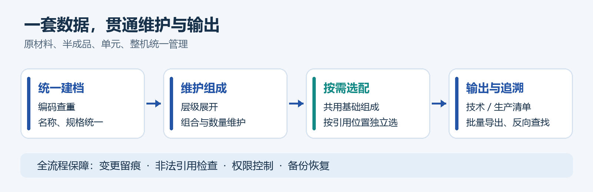
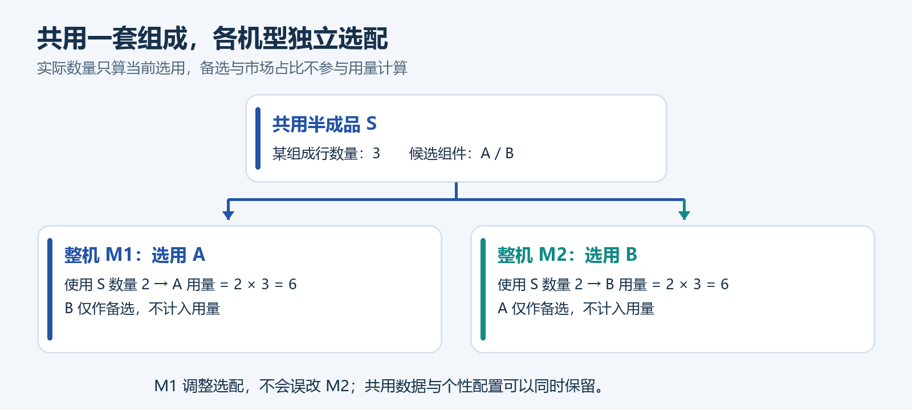

# BOM 系统建设汇报

从分散表格到统一管理，让产品组成清楚、选配准确、变更可查。

汇报日期：2026年9月24日｜前半部分为图文概览，后附“从需求到实现”专题说明；全文约8分钟。

## 一、汇报结论

已完成面向水质分析仪产品族的轻量 BOM（物料清单）系统建设，覆盖原材料、半成品、单元和整机，形成“建档—组装—选配—导出—追溯”的完整管理流程。

核心价值不是把 Excel 搬到网页，而是让共用组件可以复用、不同机型可以独立选配、生产用量按实际选用准确计算。建议在代表机型上继续开展业务试用，再逐步推广。

## 二、解决什么问题

| 业务问题 | 系统做法 | 管理价值 |
| --- | --- | --- |
| 多份表格分散维护，名称和规格容易不一致 | 统一物料档案，修改后引用处同步显示 | 减少重复维护，统一数据口径 |
| 不同机型共用组件，但选配要求不同 | 保留共用组成，允许具体机型独立选用 | 复用基础数据，避免一处调整误改其他产品 |
| 用量靠人工展开，修改影响难追查 | 自动计算、批量导出、反向追溯和变更记录 | 降低漏算、错算及沟通核对风险 |

以上为已实现能力对应的预期收益；尚未开展工时、差错率和成本改善的量化评估。

图1｜一套数据贯通维护与输出；图为业务示意，不是系统截图。

## 三、比基础 BOM 更贴合本业务的三点特色

### 1. 共用组件不必重复建，每个机型仍可独立选

同一半成品可被多个产品使用。下级选配默认继承，上级也可针对自己的引用位置单独调整，不影响其他产品。原材料可组合，半成品可嵌套，系统自动识别组合半成品。

图2｜示例：两台整机共用半成品 S，可分别选 A、B；备选和市场占比都不计入实际用量。

切换选配只改变选用组件，不改变原数量；删除到只剩主选项时可保存为无备选。同一父项出现重复选用会被阻止，不会自动合并数量。

### 2. 临时原材料与正式物料分开管理，来源有据可查

未正式原材料使用独立的 99 编码，不占正式号段，也不能作为正式 BOM 的子项。转正式时按规则新建正式物料，原记录封存并保留双向来源关系，避免临时资料混入生产组成。

### 3. 页面方便编辑，Excel 方便交付

网页用树形层级和备选行查看、编辑；Excel 用横向选配列展示，主选在前、备选在后。技术 BOM 看组成关系，生产 BOM 看实际用量，支持单项和批量导出。物料编码可弹窗查看，减少跳转打断操作。

## 四、目前做到哪一步

核心功能已完成，并完成本地数据初始化、自动化测试与构建验证；其他服务器的部署和正式业务运行效果，仍以现场验收为准。

数据规模：截至2026年9月16日清理后，本地库共有 4,903 个物料、17,865 条组成关系。其中业务数据为 4,879 个物料、17,834 条组成；其余为演示数据。该数字不是9月24日生产运营实时统计。

质量验证：最近一次修复后，后端完整测试 53 项通过，相关页面专项 2 项通过；此前完整浏览器回归 18 项通过，前端生产构建通过。测试覆盖不替代业务人员最终确认。

基础保障：具备编码查重、环路与非法引用检查、变更审计、数据库备份及固定四角色权限；管理员、研发、生产、访客各有明确操作边界。系统支持局域网浏览器使用，定位轻量，不建设复杂审批流程。

## 五、下一步建议

1. 先试用：选取2—3个代表机型，由研发与生产共同核对实际选配、数量和导出结果，形成验收样例。
2. 再固化：明确物料建档、转正式、变更说明和备份恢复的责任人；处理遗留数据与备份整理事项。
3. 后推广：用查料耗时、清单准备耗时、用量差错数衡量效果，再决定扩展或接入其他系统。

需管理层支持：明确试点机型及业务验收负责人。当前不扩大到库存、采购订单、成本核算等 ERP 范围，优先把物料和 BOM 数据做准。

依据：项目需求确认稿、特殊需求与移植指南、2026年9月16日交付及测试记录。本汇报不包含密码、个人身份标识或完整业务明细。
